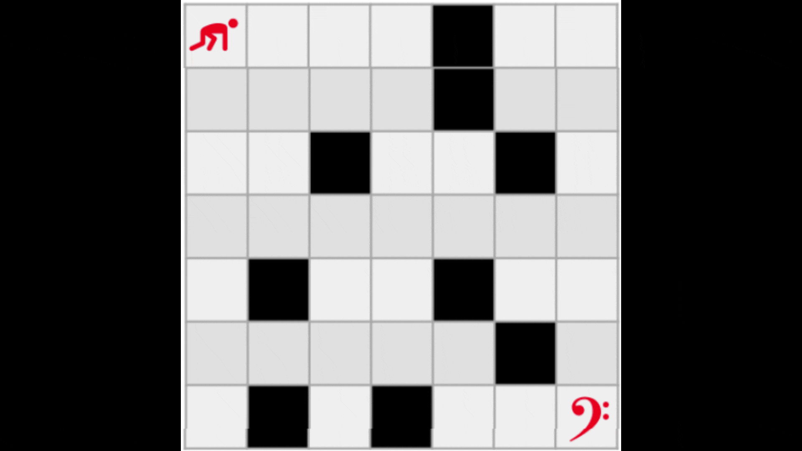
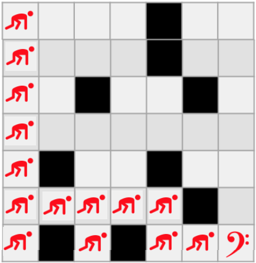
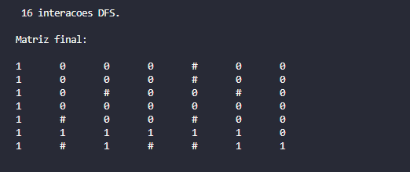

# Exercício de Tipo Abstrato de Dados Labirinto - BFS e DFS

Neste jogo, a proposta contém: (a) o tamanho da matriz; (b) a posição das paredes e; (c) o tipo de busca. Na mecânica clássica dos jogos de labirinto, o jogador se movimenta pelo cenário por diferentes direções. As direções são: para cima, para baixo, para a direita e para a esquerda.
O labirinto é apresentado ao jogador por meio de uma matriz em que cada célula é uma região transitável ou não. O personagem encontra-se em uma célula da matriz e ele pode se movimentar para as células adjacentes que são regiões transitáveis.

<h1>Busca em Largura </h1>
A busca em largura pode ser implementada de várias formas. As mais utilizadas são atráves de recursão, que utiliza uma fila<code>FIFO</code> ou seja, o último a entrar é o primeiro a sair. 
  
<h2>Entrada</h2>

<h1> Busca em Profundidades</h1>

A busca em profundidade é um algoritomo utilizado para percorrer ou buscar itens dentro das estrutura de dados. Suas características básicas é percorrer o mais profundo possível para somente depois retroceder. Existem várias formas de implementar uma busca em profundidade. Pela natureza, uma solução natural é utilizar recursão ou um algoritmo interativo e utilizar uma pilha <code>(LIFO)</code>.
  
<h2>Entrada</h2>
Como entrada do nosso algoritomo de busca em profundidade, temos o valor do tamanho da Matriz, que no caso foi: 

<code>7x7</code>

A partir do entendiemnto de como funciona o labirinto vamos a implementação do código.
A lógica implica em criar uma pilha. Enquanto a pilha não estiver vazia cheia, continuar percorrendo. Assim, nossa busca em profundidade segue uma politica de visitar sempre as posições mais profundas primeiro. Como na imagem abaixo: 

É importante citar também em termos de corretude e otimialidade ele garante encontrar, caso exista, a posição buscada. Isso ocorre, pois mantemos um mapa de posições já visitadas.

<h2>Saida</h2>

  

# Compilação e Execução

| Comando                |  Função                                                                                           |                     
| -----------------------| ------------------------------------------------------------------------------------------------- |
|  `make clean`          | Apaga a última compilação realizada contida na pasta build                                        |
|  `make`                | Executa a compilação do programa utilizando o gcc, e o resultado vai para a pasta build           |
|  `make run`            | Executa o programa da pasta build após a realização da compilação                                 |

Autores: [Gabriel Marcondes](https://github.com/DerPestarzt) e [Ygor Vieira](https://github.com/eplaie).
